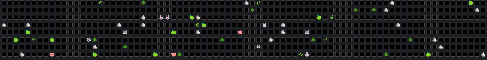
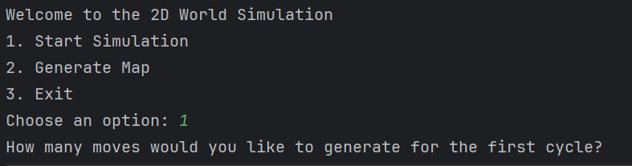
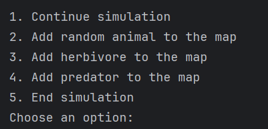
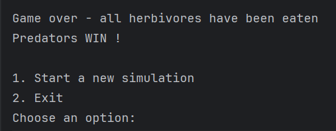

# Simulation Project

## Overview
This project is a Java-based simulation where creatures move, interact, and survive in a dynamic environment. The map is populated with various creatures and resources, and the goal is to see how long herbivores can survive against predators while competing for resources.

## Features
#### Map generation: the map is self-generated and filled with creatures, including herbivores, predators, and resources such as grass and apples.

#### Creature Movement: each creature has a speed that determines how much movement it can make per turn.
#### Predator-Herbivore Interaction: predators prey on herbivores and herbivores consume resources to survive.
#### Special Pathfinding Algorithm: creatures use a special pathfinding algorithm to find resources or loot.
#### Victory Condition: the simulation ends when all herbivores are eaten or all predators starve to death.

## Game Mechanics

### Starting the Simulation:
At the beginning of the game, you will be prompted to decide whether you want to start the simulation or exit.

### Rounds:
The game operates in rounds. You must specify the number of moves (turns) you want the simulation to perform. After each set of moves, you can take the following actions:
* Add creatures to the map.
* End the simulation.
* Continue the simulation by specifying the number of additional moves.

### End Conditions:
The simulation will automatically pause if all predators or all herbivores die. At this point, you will have the option to:
* Start a new simulation with a completely new map.
* Exit the simulation.

